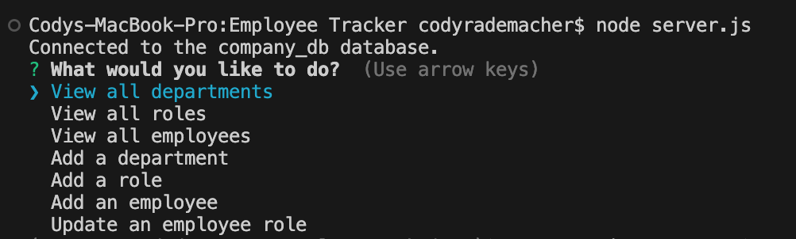

# Employee Tracker

## Description

- What problem does it solve? This employee tracker app is meant to be used as a user-friendly
  database where anyone can use the app to find their company's info on different departments,
  roles, and employees, as well as add new items to each of those categories.

- What did you learn? I learned how to use mysql as well as integrate inquirer into it so that
  even users who do not know how to use SQL databases can navigate and find the info they need.

## Installation

I used npm to install the various tools I would need for this application (express to build and
run my own server, mysql2 to use mysql, inquirer to allow users to answer questions/navigate
through the app, and sequelize to allow us to utilize javascript to write to the sql database
directly instead of logging into mysql and writing sql code.)

## Usage

Users simply need to input 'node server.js' into the terminal to start the app, then use the arrow keys
and the enter button to select desired data. To exit, either hit enter while on "Quit" or hit "Control C" at any time to shut down the server.

## License

MIT

---
